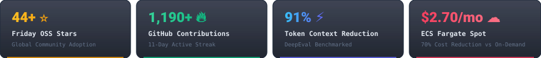

<div align="center">



<br/>

[;Creator+of+ReelDM+%E2%9E%94+Live+Instagram+Automation+SaaS+(reeldm.space);Architecting+Resilient+AWS+Cloud+with+Terraform+%26+Kubernetes;Building+Stateful+LangGraph+Agents+%26+Neo4j+Knowledge+Graphs)](https://git.io/typing-svg)

<p align="center">
  <a href="https://github.com/friday-memory/friday"></a>
  <a href="https://reeldm.space"></a>
  <a href="https://finopsai.space"></a>
  <a href="https://linkedin.com/in/itskie"></a>
  <a href="mailto:itskie7910@gmail.com"></a>
</p>



</div>

---

### 💻 System Terminal

```python
class ShobhitSingh:
    role = "AI Systems & Cloud Infrastructure Architect"
    location = "Dhanbad / Bengaluru, India (Open to Relocate)"
    
    flagship_platforms = {
        "friday_oss": "Persistent Cognitive Memory Substrate for AI Agents (44★, MCP, Neo4j)",
        "reeldm_saas": "Live Instagram Lead Qualification & DM Automation SaaS on AWS EC2",
        "finops_ai": "Production AWS Cost Governance SaaS (17 regions <30s, $2.70/mo)",
        "infragenie": "Autonomous DevSecOps Orchestrator (Tree-sitter AST, Aqua Trivy)"
    }
    
    philosophy = "Deploy Fast. Break Nothing. Automate Everything. 🚀"
```

---

## 🌟 Featured Production Platforms & Architectures

<table>
  <tr>
    <td width="50%" valign="top">
      <h3 align="center">🧠 Friday — Cognitive Memory Substrate</h3>
      <p align="center"><b>Open-Source MCP Server · <a href="https://github.com/friday-memory/friday">44★ GitHub Stars</a> · 4 Forks</b></p>
      <p>Architected an open-source persistent memory substrate for LLMs and autonomous coding agents via <b>Model Context Protocol (MCP)</b>. Combines <b>Neo4j</b> knowledge graph traversal (Cypher) with <b>ChromaDB</b> vector retrieval, benchmarking a <b>91% token reduction</b> in agent context windows.</p>
      <p align="center">
        
        
        
        
        
      </p>
      <p align="center">
        <a href="https://github.com/friday-memory/friday"><b>⭐ View Repository (44★ Stars) →</b></a><br/>
        <sub>DeepEval Token Benchmarks • 1-Command Installer • Neural Studio</sub>
      </p>
    </td>
    <td width="50%" valign="top">
      <h3 align="center">🎬 ReelDM — Social Lead Engine</h3>
      <p align="center"><b>Live Instagram Automation SaaS [<a href="https://reeldm.space">reeldm.space</a>]</b></p>
      <p>High-throughput Meta Graph API & Webhook automation engine deployed on AWS EC2 with Elastic IP. Automates real-time comment-to-DM conversion, follow-gate validation, and instant lead routing with sub-second response times.</p>
      <p align="center">
        
        
        
        
        
      </p>
      <p align="center">
        <a href="https://reeldm.space"><b>🌐 Visit Live SaaS (reeldm.space) →</b></a><br/>
        <sub>HMAC SHA-256 Webhook Verification • Distributed Rate Limiting</sub>
      </p>
    </td>
  </tr>
  <tr>
    <td width="50%" valign="top">
      <h3 align="center">💰 FinOps-AI — Cost Governance</h3>
      <p align="center"><b>Live AWS Cost Governance SaaS [<a href="https://finopsai.space">finopsai.space</a>]</b></p>
      <p>Autonomously audits & detects zombie cloud assets across 17 AWS regions in &lt;30s. Generates 1-click Terraform HCL + Bash cleanup scripts with Tag Immunity Shields. Running on ECS Fargate Spot behind ALB for <b>$2.70/month</b> (70% savings).</p>
      <p align="center">
        
        
        
        
      </p>
      <p align="center">
        <a href="https://finopsai.space"><b>🌐 Visit Live SaaS (finopsai.space) →</b></a><br/>
        <sub>Multi-Region Cloud Audit • Tag Immunity Shields</sub>
      </p>
    </td>
    <td width="50%" valign="top">
      <h3 align="center">🧞‍♂️ InfraGenie — DevSecOps CLI</h3>
      <p align="center"><b>Autonomous AI-Native DevSecOps Orchestrator</b></p>
      <p>Autonomous CLI parsing source code AST across 6 languages via Tree-sitter, generating CIS-hardened Dockerfiles, and provisioning AWS ECS infrastructure in &lt;2 minutes (<b>98.5% faster</b>). Automated Aqua Trivy CVE blocking with 55 unit tests.</p>
      <p align="center">
        
        
        
        
      </p>
      <p align="center">
        <a href="https://github.com/itskie"><b>⭐ View Repository →</b></a><br/>
        <sub>Self-Healing IaC • 55 Automated Unit Tests</sub>
      </p>
    </td>
  </tr>
</table>

---

## 🛠️ Engineered Tech Stack

<div align="center">

### 🤖 Autonomous AI & Agentic Systems
<p align="center">
  
  
  
  
  
  
</p>

### ☁️ Cloud Infrastructure & Container Orchestration
<p align="center">
  <a href="https://skillicons.dev">
    
  </a>
</p>

### ⚡ Backend & High-Throughput Microservices
<p align="center">
  <a href="https://skillicons.dev">
    
  </a>
</p>

### 🛡️ DevSecOps, Security & Observability
<p align="center">
  <a href="https://skillicons.dev">
    
  </a>
</p>

</div>

---

## 📊 Live GitHub Telemetry

<div align="center">
  
  
</div>

<br/>

---

<div align="center">
  <sub>⚡ Engineered with precision by <b>Shobhit Singh</b> • Autonomous, stateful, and production-tested.</sub><br/>
  <sub><i>"Deploy Fast. Break Nothing. Automate Everything."</i></sub>
</div>
