<!-- profile-forge:start -->

<h3><code>itskie@github ~ $ ./contributions.sh</code></h3>

  

<h3><code>itskie@github ~ $ whoami</code></h3>

<table>
  <tr>
    <td valign="top"></td>
    <td valign="top"></td>
  </tr>
</table>

<!-- profile-forge:end -->

 

---

## ⚡ Featured Production Platforms & Architectures

<table>
  <tr>
    <td width="50%" valign="top">
      <h3 align="center">🧠 Friday (Persistent Memory Substrate)</h3>
      
<b>Open-Source Cognitive Memory MCP Server · 44★ GitHub Stars</b>

      
Architected an open-source persistent memory substrate for LLMs and autonomous coding agents via <b>Model Context Protocol (MCP)</b>. Combines <b>Neo4j</b> knowledge graph traversal (Cypher) with <b>ChromaDB</b> vector retrieval, benchmarking a <b>91% token reduction</b> in agent context windows.

      

        <a href="https://github.com/friday-memory/friday"><b>[Repository]</b></a> ·
        <a href="https://github.com/friday-memory/friday#readme"><b>[DeepEval Benchmarks]</b></a>
      

      
<code>Python</code> · <code>FastAPI</code> · <code>MCP</code> · <code>Neo4j</code> · <code>ChromaDB</code> · <code>Docker</code>

    </td>
    <td width="50%" valign="top">
      <h3 align="center">🎬 ReelDM</h3>
      
<b>Live Instagram Automation SaaS [<a href="https://reeldm.space">reeldm.space</a>]</b>

      
Live multi-tenant SaaS automating Instagram Comment-to-DM flows and follow-gated lead qualification in real time with sub-second response times. Asynchronous webhook engine processing Meta Graph API events with HMAC SHA-256 verification and Redis distributed locking.

      

        <a href="https://reeldm.space"><b>[Live SaaS]</b></a> ·
        <a href="https://github.com/itskie"><b>[Architecture]</b></a>
      

      
<code>FastAPI</code> · <code>Meta Graph API</code> · <code>AWS EC2</code> · <code>Redis</code> · <code>PostgreSQL</code>

    </td>
  </tr>
  <tr>
    <td width="50%" valign="top">
      <h3 align="center">💰 FinOps-AI</h3>
      
<b>Live AWS Cost Governance SaaS [<a href="https://finopsai.space">finopsai.space</a>]</b>

      
Audits multi-region AWS environments across 17 regions in &lt;30s, detecting orphaned EBS, idle ALBs, and stopped instances. Generates 1-click <b>Terraform HCL</b> remediation with Tag Immunity Shields; runs on ECS Fargate Spot behind ALB for <b>$2.70/month</b> (70% savings).

      

        <a href="https://finopsai.space"><b>[Live SaaS]</b></a> ·
        <a href="https://github.com/itskie"><b>[Code]</b></a>
      

      
<code>Python</code> · <code>AWS ECS Fargate Spot</code> · <code>Terraform IaC</code> · <code>Boto3</code> · <code>ALB</code>

    </td>
    <td width="50%" valign="top">
      <h3 align="center">🧞‍♂️ InfraGenie</h3>
      
<b>AI-Native DevSecOps Orchestrator</b>

      
Autonomous CLI parsing source code AST across 6 languages, generating CIS-hardened Dockerfiles and auto-provisioning AWS ECS infrastructure in &lt;2 minutes (<b>98.5% faster</b>). Automated vulnerability triage with <b>Aqua Trivy</b> and 55 unit tests.

      

        <a href="https://github.com/itskie"><b>[Repository]</b></a>
      

      
<code>Python</code> · <code>Tree-sitter AST</code> · <code>Aqua Trivy</code> · <code>Docker</code> · <code>AWS ECS</code>

    </td>
  </tr>
</table>

 

  Engineered with precision. Autonomous, stateful, and production-tested.

